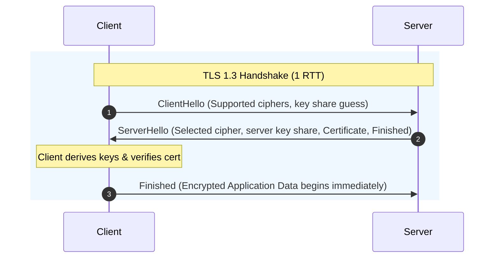

# Lifecycle of HTTP & HTTPS Requests: A Network Perspective

This document serves as a quick revision guide focusing on the network-level differences and the lifecycle of HTTP and HTTPS requests.

---

## 1. Network Protocol Stack Comparison

| Layer | HTTP | HTTPS |
| :--- | :--- | :--- |
| **Application** | HTTP | HTTP |
| **Security/Encryption** | *None* | **TLS / SSL** |
| **Transport** | TCP (Port 80) | TCP (Port 443) |
| **Network** | IP | IP |

---

## 2. Step-by-Step Lifecycle (Network Level)

### Step 1: DNS Resolution (Domain Name System)
* **Goal:** Translate human-readable hostname (e.g., `example.com`) to an IP address.
* **Network Protocol:** Typically runs over **UDP Port 53** (falls back to TCP if response is too large).
* **Latency:** 0 to 1+ Round Trip Time (RTT) depending on local cache (browser, OS, router, ISP resolver).

### Step 2: TCP Connection (3-Way Handshake)
Before any HTTP data is sent, a reliable connection must be established at the Transport Layer.
1. **SYN:** Client sends a synchronization segment to Server (random sequence number `Seq=x`).
2. **SYN-ACK:** Server responds acknowledging the client's request (`Ack=x+1`) and sending its own sequence number (`Seq=y`).
3. **ACK:** Client acknowledges the server (`Ack=y+1`).
* **HTTP Target Port:** `80`
* **HTTPS Target Port:** `443`
* **Total Latency:** **1 RTT**

---

### Step 3: TLS Handshake (HTTPS Only)
Once the TCP connection is established on Port 443, the TLS handshake encrypts the communication channel.

#### TLS 1.2 vs. TLS 1.3 Handshake (Network Latency Comparison)

#### Key TLS Handshake Tasks:
1. **Negotiate Protocol Version & Cipher Suite:** Determine encryption algorithms.
2. **Authentication:** Server sends its digital certificate. Client verifies it against trusted Certificate Authorities (CAs).
3. **Key Exchange (Diffie-Hellman):** Client and server securely generate session keys without sending them over the wire.
* **Latency Overhead:**
  * **TLS 1.2:** **2 RTTs** (adds extra roundtrips for key exchange and cipher agreement).
  * **TLS 1.3:** **1 RTT** (key exchange is combined with the first hello packet). Supports **0-RTT** (Session Resumption) on subsequent connections.

---

### Step 4: HTTP Request & Response (Application Data Exchange)
* **HTTP:** Transmits data (Headers, Body) in **plaintext** over the TCP connection.
* **HTTPS:** Encrypts data before sending. The data is wrapped in **TLS Records** (using symmetric encryption keys generated during the TLS handshake) before being transmitted over TCP.
* **Latency:** **1 RTT** for the request-response cycle.

### Step 5: Connection Teardown (TCP Fin / 4-Way Handshake)
Once data exchange is complete (and if `Connection: keep-alive` isn't kept active):
1. **FIN:** Sender sends a FIN packet to initiate shutdown.
2. **ACK:** Receiver acknowledges.
3. **FIN:** Receiver sends its own FIN packet.
4. **ACK:** Sender acknowledges and closes connection.

---

## 3. Quick Summary: HTTP vs. HTTPS Network Metrics

| Metric | HTTP | HTTPS |
| :--- | :--- | :--- |
| **Default Port** | `80` | `443` |
| **Data Format on Wire** | Plaintext ASCII / Binary (HTTP/2) | Encrypted TLS Records |
| **Initial Latency (to 1st byte)** | **1 RTT** (DNS + TCP) | **2 to 3 RTTs** (DNS + TCP + TLS) |
| **Security Goals** | None | Confidentiality, Integrity, Authenticity |
| **Symmetric Encryption Key** | Not applicable | Derived using Ephemeral Diffie-Hellman (PFS) |
