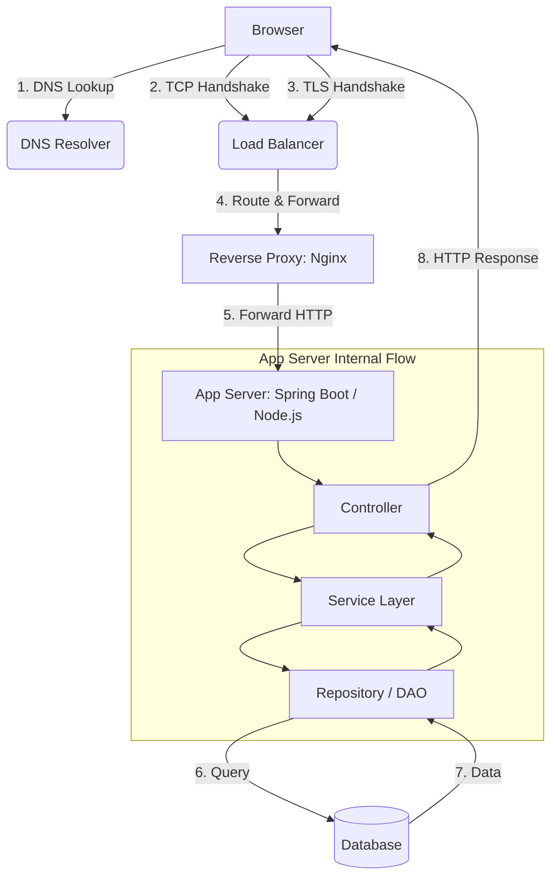

# The Lifecycle of an HTTP/HTTPS Request: End-to-End

This guide covers the complete end-to-end journey of an HTTPS request when a user visits a URL like `https://myapp.com/profile`, spanning from the browser's initial DNS query down to the database and back.

---

## 1. End-to-End Visual Journey

Here is the high-level architecture of how the request travels:



---

## Part 1: The Network Layer

### 1. DNS Lookup (Domain Name System)
* **What it does:** Translates a human-readable domain name (like `myapp.com`) to an IP address (like `18.123.10.5`) so the browser knows where to send packets.
* **Why it matters:** Avoids hardcoding IP addresses in client apps, allowing servers to change IPs dynamically without breaking client links.
* **Protocol:** Primarily **UDP Port 53** (with 0 to 1+ RTT latency depending on cache hits at browser, OS, router, or ISP levels).

### 2. TCP Handshake (Establish Connection)
Before data can be exchanged, a reliable connection must be established at the Transport Layer.
* **HTTP Port:** `80` | **HTTPS Port:** `443`
* **3-Way Handshake Steps:**
  1. **SYN:** Client sends synchronization segment (`Seq=x`) to initiate the connection.
  2. **SYN-ACK:** Server acknowledges (`Ack=x+1`) and sends its own segment (`Seq=y`).
  3. **ACK:** Client acknowledges the server (`Ack=y+1`).
* **Latency:** **1 RTT** (Round Trip Time).

### 3. TLS Handshake (Secure the Channel)
* **What it does:** Creates an encrypted connection over Port 443.
* **Without TLS (Plain HTTP):** Sensitive data (credentials, personal details) travel in plain text, visible to anyone on the network path.
* **With TLS:** All application payloads are encrypted symmetrically.
* **TLS Versions & Latency:**
  * **TLS 1.2:** **2 RTTs** (separate cipher negotiation and key exchange phases).
  * **TLS 1.3:** **1 RTT** (key share is sent alongside the client hello).

---

## Part 2: The Infrastructure Layer

### 4. Load Balancer (LB)
Large applications do not run on a single server. A Load Balancer sits at the entry point of the network.
* **Routing:** Distributes incoming traffic across multiple instances (e.g., Server 1, Server 2, Server 3).
* **Key Benefits:**
  * **High Availability:** If one server crashes, traffic is routed to healthy instances.
  * **Horizontal Scaling:** Easily add more servers to handle increased traffic.
  * **Failover:** Performs health checks to bypass unresponsive nodes.

### 5. Reverse Proxy (e.g., Nginx)
Typically placed directly behind the load balancer or as the first contact point on the application VM.
* **Key Responsibilities:**
  * **SSL/TLS Termination:** Decrypts the HTTPS request here so backend app servers only have to handle plain HTTP, saving CPU resources.
  * **Rate Limiting:** Prevents abuse/DDoS by limiting requests per IP address.
  * **Static File Serving:** Instantly serves CSS, JS, and images without hitting the application server.
  * **Compression (Gzip/Brotli):** Compresses responses to reduce network transfer sizes.

---

## Part 3: The Application Layer

Once Nginx forwards the request, it reaches the **Application Server** (e.g., Spring Boot, Node.js/Express) executing on a specific port.

### 6. MVC Architecture Flow

Inside the application server, the request traverses a strict layered architecture:

```
[Incoming Request] ──> Controller ──> Service Layer ──> Repository ──> Database
```

#### Layer 1: Controller
* **Role:** The entry point/handler of the application.
* **Design Rule:** **Never put business logic inside controllers.**
* **Responsibilities:**
  * Validate incoming request payloads/headers.
  * Call the appropriate service layer method.
  * Format and return the HTTP response status and body.

#### Layer 2: Service Layer
* **Role:** The core brain of your application.
* **Responsibilities:**
  * Contains all business logic, validation rules, algorithms, and transactional control.
  * Orchestrates data flow between controllers and repositories.

#### Layer 3: Repository / DAO
* **Role:** The data access layer.
* **Responsibilities:**
  * Interfaces directly with the database (using ORMs like Hibernate or raw SQL clients).
  * Performs CRUD (Create, Read, Update, Delete) operations.

#### Layer 4: Database
* **Role:** Persistent storage (e.g., PostgreSQL, MongoDB).
* **Action:** Executes the query from the repository layer and returns the raw data back up the stack.

---

## 4. HTTP vs. HTTPS Network & Architecture Metrics

| Metric | HTTP | HTTPS |
| :--- | :--- | :--- |
| **Default Port** | `80` | `443` |
| **Data Format on Wire** | Plaintext (ASCII / HTTP/2 binary) | Encrypted TLS Records |
| **Establishment Latency** | **1 RTT** (TCP) | **2 to 3 RTTs** (TCP + TLS) |
| **Security** | Vulnerable to MITM & eavesdropping | Encrypted, verified, and tamper-proof |
| **SSL Termination Point** | Not applicable | Typically handled at Load Balancer or Nginx |
